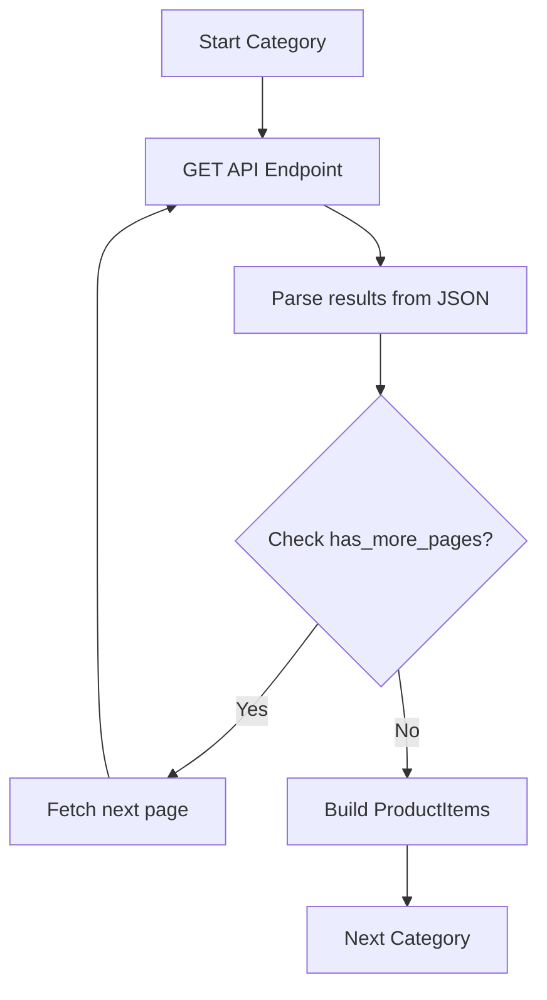
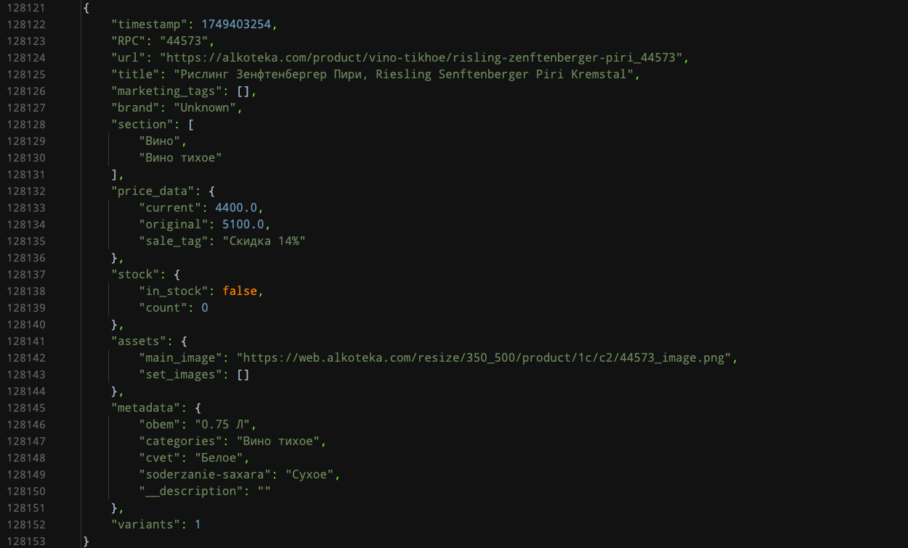
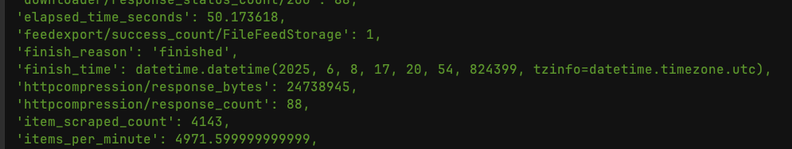
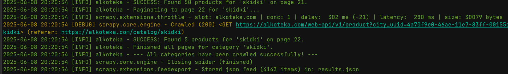
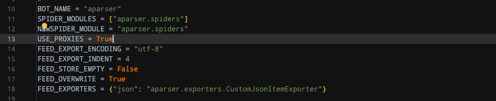
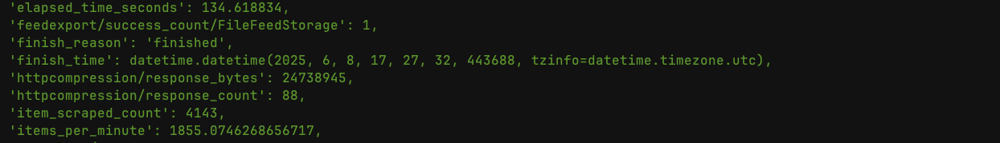
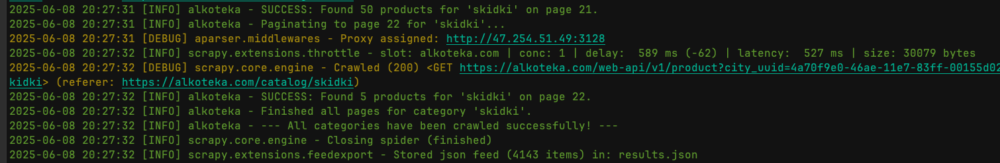
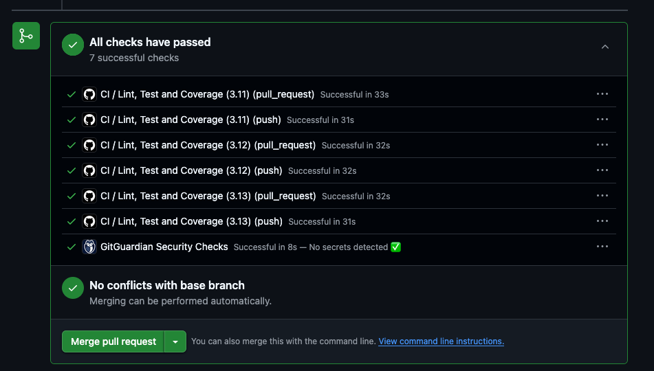
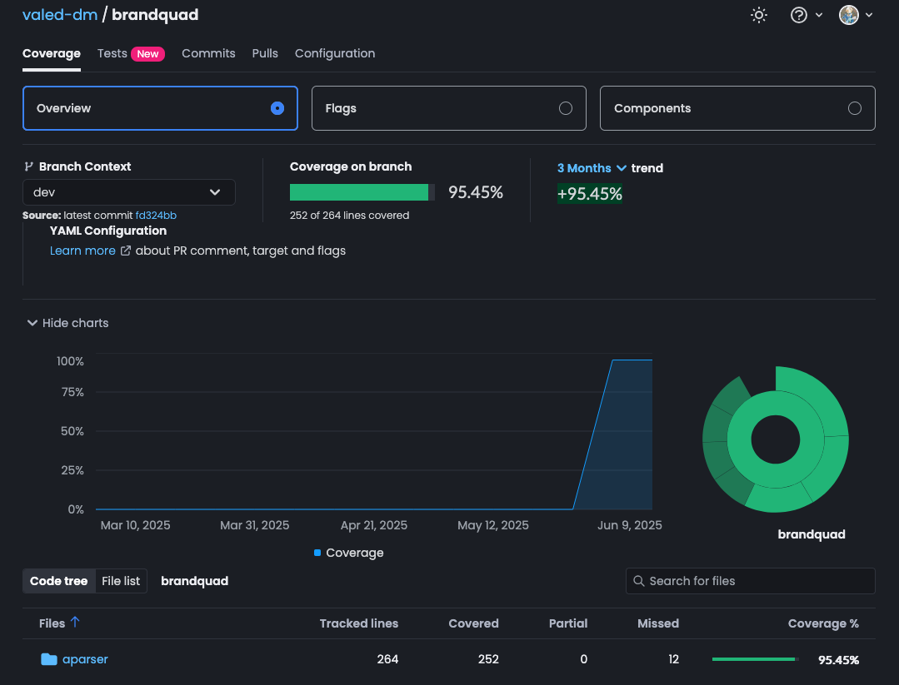

# 🕷️ E-commerce Scraper (Pure Scrapy)

A minimalistic, production-ready Scrapy spider for e-commerce product data extraction.

<!-- Badge Definitions -->
[scrapy-badge]: https://img.shields.io/badge/Scrapy-2.11+-brightgreen
[scrapy-link]: https://scrapy.org/
[python-badge]: https://img.shields.io/badge/Python-3.12%2B-blue
[python-link]: https://www.python.org/
[license-badge]: https://img.shields.io/badge/License-MIT-yellow
[license-link]: LICENSE
[coverage-badge]: https://img.shields.io/badge/coverage-90%25-green
[ci-badge]: https://github.com/valed-dm/brandquad/actions/workflows/ci.yaml/badge.svg
[ci-link]: https://github.com/valed-dm/brandquad/actions/workflows/ci.yaml

<!-- Badges -->
[![Scrapy][scrapy-badge]][scrapy-link]
[![Python][python-badge]][python-link]
[![License][license-badge]][license-link]
[](https://github.com/astral-sh/ruff)
![Coverage][coverage-badge]
[![CI][ci-badge]][ci-link]

## Features
- **Pure Scrapy** (no external dependencies beyond `scrapy`)
- Structured items (`ProductItem`)

## Achievements

- Dynamic JavaScript Content: Pure HTML parsing was impossible.
- API Reverse-Engineering: The hidden API endpoint for JavaScript is found.
- Header and Session Puzzles: Proper use of Referer headers and cookies.
- Advanced Rate-Limiting: The server was "soft blocking" based on request concurrency, not just headers.
- The Chained-Request Solution: A serial crawling strategy to mimic human behavior and bypass the rate-limiter.
- JSON Structure Debugging: The API response is debugged to find the correct keys (results instead of data).
- Pagination Logic: The true pagination key (has_more_pages instead of last_page) is found.
- Identify the correct, working API endpoint for city data.
- Determine the correct parameters to get the full list.
- Generate a clean, machine-readable list of all cities and their internal uuid codes.

## Quick Start
```bash
scrapy crawl alkoteka
scrapy crawl cities -O cities.jsonl
```

# Scraping Methodology

This scraper is designed to handle modern, dynamic websites built as Single Page Applications (SPAs). Traditional HTML parsing approaches are ineffective since the initial page response is just a shell, with all content loaded via JavaScript.

## Approach: API-First Strategy

To overcome SPA challenges without browser automation tools (Playwright/Selenium), this project employs:

- Reverse-engineering the website's internal API
- Direct interaction with the API endpoints
- Mimicking frontend API calls for data retrieval

## Key Challenges & Solutions

| Challenge | Solution |
|-----------|----------|
| **Dynamic Content Rendering**<br>Initial HTML is empty | - Monitor network traffic via browser dev tools<br>- Identified internal API endpoint (`/web-api/v1/product`) |
| **API Rate-Limiting & Concurrency Blocking**<br>Parallel requests caused "soft blocks" (200 OK but empty results) | - Re-architected for serial crawling<br>- Complete one category (with pagination) before proceeding<br>- "Chained request" pattern mimics human behavior |
| **Header and Session Complexity**<br>Over-engineered headers were counter-productive | - Minimal, clean headers:<br>  - Standard browser User-Agent<br>  - Correct Referer header pointing to catalog page |

## Final Implementation Strategy

### 1. Serial Category Crawling
- Processes target category slugs sequentially
- Only proceeds to next category after current one is fully completed

### 2. Intelligent Throttling
```python
# Scrapy Configuration
AUTOTHROTTLE_ENABLED = True
AUTOTHROTTLE_TARGET_CONCURRENCY = 1.0  # Enforces "one request at a time"
```

### 3. Direct API Parsing Flow

For each category, the scraper performs the following operations:



### API Request
- Direct `GET` request to the API endpoint
- Minimal required headers:
  ```http
  GET /web-api/v1/product HTTP/1.1
  Host: example.com
  User-Agent: Mozilla/5.0
  Referer: https://example.com/catalog

### Screenshots


[]()

[]()

[]()

[]()

[]()

[]()

[]()

[]()
